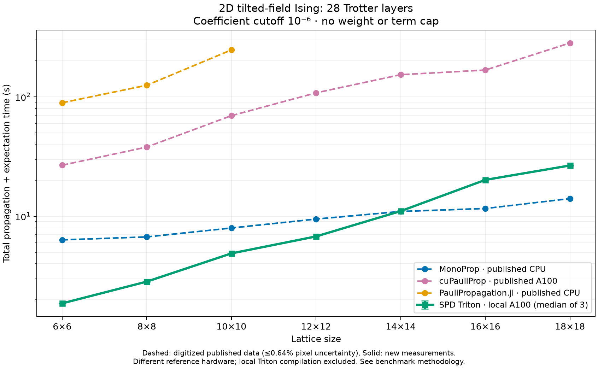

# A100 comparison with the published MonoProp benchmark

This directory compares SPD's persistent Triton forward execution against the
[published MonoProp benchmark](https://docs.monoprop.algorithmiq.tech/benchmarks).
MonoProp was **not run**. Its results and the other published curves are imported
reference measurements. cuPauliProp was run locally for the fixed-lattice sanity
check, and Triton was run locally for that check and the seven-size sweep.



See [the measured tables](RESULTS.md), [scaling CSV](scaling_comparison.csv),
[fixed-lattice CSV](fixed_comparison.csv), and [validation results](validation.json).
The comparison demonstrates a substantial advantage over the published GPU
reference on these workloads. MonoProp is faster at the largest sizes; this is
not evidence that Triton is universally the fastest engine.

## Exact workload

The model follows the authors' pinned
[model.py](https://github.com/Algorithmiq/monoprop/blob/5ca9a35faf0dad5590a364757f862d4b528e3c54/packages/bench-third-party/pauli_prop/model.py)
and [settings](reference/settings.json): open-boundary, square, tilted-field
Ising lattices, `hx=hz=1`, `J=1.5`, `dt=.05`, coefficient threshold `1e-6`,
float64, no binding Pauli-weight cutoff, and no term cap.

One layer authors right/down nearest-neighbor RZZ bonds in row-major order,
then all RZ gates, then all RX gates. The angles are `.075`, `.05`, and `.05`
respectively, in the `exp(-i theta P/2)` convention. Heisenberg execution
reverses that exact gate list. The observable is evaluated in the all-zero state.

- **Fixed lattice:** 12×12, initial `ZZ` on physical qubits `[20,21]`, 28 layers.
  The source's labels `0,2,...,54` are 28 recorded points: its driver applies one
  layer per point, not 54 layers. The published cuPauliProp final support is
  31,164,633; MonoProp has 33,309,328 terms.
- **Scaling:** 6×6, 8×8, ..., 18×18, still 28 layers, with `ZZ` moved to the
  central horizontal bond at each size. At 12×12 that is `[77,78]`. This is a
  different observable from the fixed-lattice test and therefore a different
  support size. At 100 qubits and above, cuPauliProp and Triton have 50,738,776
  final terms; published MonoProp has 54,953,055.

`run_benchmark.py` recreates the gate list directly as normalized rotations;
there is no frontend reordering, weight pruning, or optional arithmetic/indexing
experiment. Triton uses `apply_in_place(..., diagnostics=False)` across gates
and layers, preserving the hash table and spare row capacity. This measures
forward propagation plus expectation evaluation, not gradient or diagnostic
history generation.

## Correctness and timing

The small 3×3, four-layer comparison checks every canonical key and coefficient
against local cuPauliProp. Spare-capacity rows are excluded from the exports.
The 12×12 validation checks counts and expectations at all 28 layers against
the published GPU data. Scaling checks every trial's final count and expectation
against the published GPU series. These large checks do not compare every
coefficient. Exact arrays are compared only in the small case.

The timer includes gate propagation, expectation evaluation, count readback, and
GPU synchronization on both boundaries. Imports, initial construction, output
files, and garbage collection are outside the timer. Each process first compiles
on a disposable one-layer input with tiny support (plus Triton compaction); there
is no repeated full-workload warm-up. Fixed-lattice results are one measured run
per local engine. Scaling is three independent processes per size, sequentially;
the solid curve is their median and error bars span min to max. They are sample
ranges, not confidence intervals. Each process has a 300-second limit.

The reference scaling plot sums all 28 timed points, including its first-point
one-off initialization. Our totals also sum all 28, but kernel compilation has
already run on tiny inputs. The CSV includes both sides' totals excluding the
first point so readers can assess that asymmetry. The published fixed-lattice
timing arrays omit their first point while count/expectation arrays retain it;
we use their final timing entry directly, without shifting count alignment.

Equal coefficient thresholds do not imply identical truncation algorithms:
MonoProp's branch threshold can retain a different support from post-rotation
coefficient filtering in Triton/cuPauliProp. Its extra terms do not establish
greater accuracy. The plot compares the published settings and actual results;
it does not assert identical operators across every engine.

## Hardware and memory

Local measurements: one NVIDIA A100-SXM4-80GB, PyTorch 2.8.0+cu128, Triton 3.4.0,
CuPy 14.2.0, cuQuantum 26.6.0. The GPU was idle before benchmarking; benchmark
processes ran sequentially. [Environment](environment.json) records CPU, GPU,
software, allocator configuration, and source fingerprints.

The published GPU is identified as A100-SXM-64GB on Leonardo's Booster partition.
Published MonoProp used one 56-core Xeon Platinum 8480+ socket; Julia used 28
threads, and the other CPU engines were serial. These are comparisons of the
reported hardware/software configurations, not isolated algorithmic speedups.

Triton memory uses PyTorch's per-step peak **allocated** and **reserved** counters.
cuPauliProp uses CuPy's default caching pool and an allocation-event hook for its
used/reserved peaks, with blocking execution and the upstream `memory_limit="80%"`.
The budget is a fraction of device capacity, so our 80GB card differs from the
reported 64GB reference. Allocation-hook overhead is inside cuPauliProp timing,
as in the reference measurement approach. Local GPU memory includes live buffers
and transient allocations seen by those allocators, not all driver/context memory.
No cache flushing occurs in measured propagation.

The fixed table preserves published CPU host RSS versus GPU device allocation as
separate memory types. Source code divides these quantities by 2^20, so our
headings use **MiB**, although the website labels them MB. Local reserved peaks
are in the CSV; host process lifetime RSS is in each raw result and is not
substituted for GPU memory. We reproduce the published cuPauliProp counts and
expectations, but do not claim identical runtime or memory on this different
card. The local fixed run allocates more GPU memory than its published counterpart.

## Digitization and provenance

The dashed curves use [digitized_scaling.csv](reference/digitized_scaling.csv),
extracted from the supplied plot's marker centers with categorical x positions
and logarithmic y calibration. Calibration comes from the 10s/100s grid lines,
not from the underlying timing values. A conservative ±1-pixel uncertainty is
about ±0.64% in runtime. The largest discrepancy from the authors' exact JSONL
values is below 0.46%. Tables use exact published values and identify their source.

The documentation image endpoint returned HTTP 403, so the source image was
retrieved from the authors' repository at revision
`5ca9a35faf0dad5590a364757f862d4b528e3c54`. Image, exact published JSON/JSONL,
settings, hashes, and retrieval URLs are retained under [reference/](reference/).
[provenance.json](reference/provenance.json) identifies each source. The upstream
[Apache license](reference/LICENSE) and [notice](reference/NOTICE) accompany these
reference artifacts. No MonoProp implementation is vendored or executed.

## Reproduce

Run from the SPD repository root. Install SPD's Triton extra and plotting tools;
cuPauliProp is needed only for the GPU sanity comparison:

```sh
pip install -e '.[triton]'
pip install 'matplotlib>=3.9' pillow
pip install 'cuquantum-python-cu12==26.6.0' 'cupy-cuda12x==14.2.0'

python benchmarks/monoprop/run_benchmark.py --backend cupauliprop --output /tmp/fixed_cupauliprop.json
python benchmarks/monoprop/run_benchmark.py --backend triton --output /tmp/fixed_triton.json
python benchmarks/monoprop/run_sweep.py --output-dir /tmp/monoprop-scaling --repeats 3
```

The sweep skips a completed output and refuses to overwrite an incomplete one.
For a fresh full artifact rebuild, write the fixed outputs and sweep outputs to
`benchmarks/monoprop/results/`, then run:

```sh
python benchmarks/monoprop/run_benchmark.py --backend triton --n 3 --steps 4 --observable central --dump --output benchmarks/monoprop/results/small_triton.json
python benchmarks/monoprop/run_benchmark.py --backend cupauliprop --n 3 --steps 4 --observable central --dump --output benchmarks/monoprop/results/small_cupauliprop.json
python benchmarks/monoprop/digitize.py
python benchmarks/monoprop/plot_comparison.py
```

The last two commands only process saved data. `plot_comparison.py` checks
correctness before accepting the measurements and writes PNG/SVG, CSV/Markdown
tables, validation, and source/result hashes. Raw results are under `results/`.

## Historical benchmark cleanup

The old MonoProp driver, thread-count results, and companion cuPauliProp driver
have moved from `examples/` into [legacy/](legacy/README.md). They use the older
11×11 XX+Z / center-site Z workload with different couplings, time step, cutoff,
and full-input warm-ups. They remain separate from this published benchmark.
The broader historical milestone comparison scripts are not part of this run.

The Studio's preinstalled Matplotlib was incompatible with NumPy 2. Plotting used
Matplotlib 3.11.2 in `/tmp/spd-monoprop-plot` via `PYTHONPATH`, leaving the GPU
benchmark environment unchanged.

## Light-cone pruning follow-up

The earlier **per-step** experiment rebuilt a pruning plan at each of the 28
steps of the exact fixed 12×12 workload. It compared execution with and without
light-cone pruning on the workspace's NVIDIA L4. All final keys and coefficients
were bitwise identical in a complete run-pair comparison. Across three fresh
trials per mode, pruning reduced gate applications by 71.4%, but total runtime
improved only 2.3%; the last step was 5.5% slower because the current planner
copies and scans the growing Pauli state on the CPU. These are fresh L4 timings,
not comparisons against the saved A100 runtimes above. See the
[pruning report and per-step data](../light_cone/monoprop_fixed_12x12/README.md).

For the intended usage—construct all 28 layers and call public `evolve` once
from the initial observable—see the corrected
[whole-circuit comparison](../light_cone/monoprop_full_12x12/README.md).
The per-step timings above do not measure that API usage.


The subsequent [GPU support-reduction experiment](../light_cone/monoprop_gpu_support_12x12/README.md)
replaces full-state CPU transfer with an on-device support scan. Fresh per-step
runs measured 17.472 s unpruned versus 8.046 s pruned (2.17×), with total planning
247 ms instead of the historical 9.265 s. These use the original diagnostics-free
benchmark loop; see the report for methodology and full coefficient validation.
